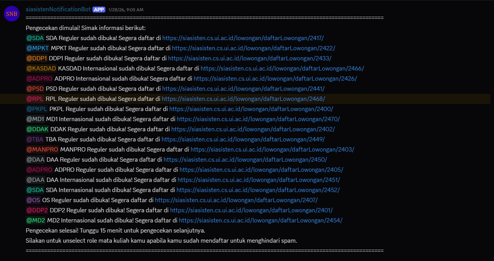

# siasistenNotificationBot

**Overview**
- **Purpose:** Automatically notify interested users on Discord when courses on siasisten.cs.ui.ac.id open for TA applications.
- **Why it exists:** The university site does not send notifications. This bot removes the need to check the site manually.

**Problem**
- Checking the course page repeatedly is slow and easy to miss. There is no built-in alert system on the site.

**Solution**
- This project runs a Discord bot that checks the site every 15 minutes and posts a message in a Discord channel when a course becomes available for TA applications. The bot tags the users who are interested in that course so they see the update quickly.

**How it works (simple)**
- The bot reads a list of courses and who is interested in them.
- Every 15 minutes it checks the siasisten website for newly opened course listings.
- When a course is found open, the bot posts the course link and mentions the people who want to apply.

**Screenshot of Example Usage**

**Notes**
- The bot reduces the delay between a course opening and users seeing the posting, improving the chance to apply promptly.
- If you change the check interval or notification rules, review `main.py` for the configuration variables.
- The bot is hosted on Katabump so that it runs 24/7 without needing a local computer to constantly stay on.

**Contributing**
- Fixes and improvements are welcome. If you make changes, test locally.
